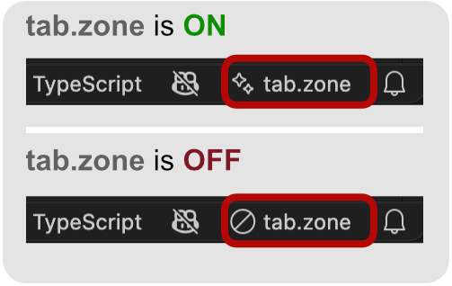

# tab.zone

Copilot-style **tab autocomplete for VS Code, powered by a local [Ollama](https://ollama.com) server**. Your code never leaves your machine. Inline (ghost-text) completions appear as you type; press <kbd>Tab</kbd> to accept.

## Requirements

- [Ollama](https://ollama.com) running locally (default `http://localhost:11434`)
- A fill-in-the-middle (FIM) capable code model. **tab.zone doesn't download models for you** — pull one first. The default model is `qwen2.5-coder:3b`:

  ```sh
  ollama pull qwen2.5-coder:3b
  ```

  `3b` is a good speed/quality balance for line completion. For faster, lighter suggestions use `qwen2.5-coder:1.5b`; for higher quality use `qwen2.5-coder:7b`. Whichever you pull, set `tabZone.model` to match (and `tabZone.fimTemplate` to the model family).

## Install

From the VS Code Marketplace: **[tab.zone](https://marketplace.visualstudio.com/items?itemName=studiomedio.tab-zone)**, or:

```sh
ext install studiomedio.tab-zone
```

## Configuration

| Setting | Default | Description |
| --- | --- | --- |
| `tabZone.enabled` | `true` | Enable inline (ghost text) completions. |
| `tabZone.endpoint` | `http://localhost:11434` | Base URL of the local Ollama server. |
| `tabZone.model` | `qwen2.5-coder:3b` | Ollama FIM-capable code model to use. Smaller (1.5b/3b) = faster. |
| `tabZone.fimTemplate` | `qwen` | FIM prompt template matching the model family (`qwen`, `codellama`, `starcoder`, `deepseek`). |
| `tabZone.debounceMs` | `250` | Delay after the last keystroke before requesting a completion. |
| `tabZone.maxPrefixChars` | `3000` | Max characters of context taken from before the cursor. |
| `tabZone.maxSuffixChars` | `1000` | Max characters of context taken from after the cursor. |
| `tabZone.maxTokens` | `128` | Max tokens generated per completion. Lower is faster. |
| `tabZone.maxLines` | `4` | Max lines kept from a completion. `1` = strict single-line, `0` = no limit. |
| `tabZone.temperature` | `0.1` | Sampling temperature. Lower is more deterministic. |

## Usage

As you type, suggestions appear as grey ghost text — press <kbd>Tab</kbd> to accept.

Toggle completions on/off by clicking the **tab.zone** item in the status bar, or by running **tab.zone: Toggle inline completions** from the Command Palette. The status-bar icon shows the current state:



## Development

```sh
npm install
npm run watch        # rebuild on change
```

Press <kbd>F5</kbd> in VS Code to launch the Extension Development Host.

```sh
npm run typecheck    # tsc --noEmit
npm run package      # minified production build
```

## License

[MIT](./LICENSE) © Studio Medio
